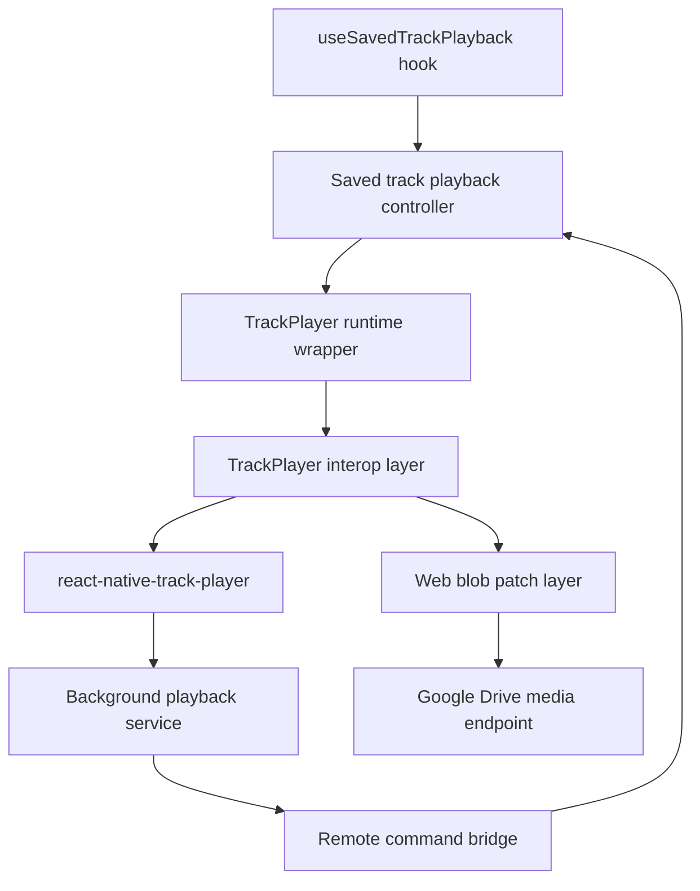

# Mobile Cross-Platform Audio Playback

This document explains how the mobile rehearsal player implements cross-platform playback with `react-native-track-player` and web runtime support that depends on `shaka-player`.

## Summary

- Native iOS and Android playback uses `react-native-track-player` directly.
- Web playback also uses `react-native-track-player` (web runtime), but media loading is patched so authenticated Google Drive requests can be fetched with headers and replayed as blob URLs.
- Background and lock-screen transport controls are bridged through a module-level command handler so native remote events can drive the active React playback controller.

## Why `shaka-player` Is in This App

- `shaka-player` is included as a direct dependency of `@org/mobile-rehearsal-player` to satisfy the web runtime path used by `react-native-track-player`.
- Without this dependency, Expo web/export can fail during module resolution before render.
- The app code does not import `shaka-player` directly; it is required by the TrackPlayer web stack.

## Playback Architecture

## Key Modules

- App entry and service registration:
  - `packages/mobile-rehearsal-player/index.js`
- TrackPlayer interop and environment detection:
  - `packages/mobile-rehearsal-player/src/app/library/playback/utils/saved-track-player-interop.ts`
- Web runtime patching (header fetch -> blob URL -> cleanup):
  - `packages/mobile-rehearsal-player/src/app/library/playback/utils/saved-track-player-web-load.ts`
- Player setup and capability sync:
  - `packages/mobile-rehearsal-player/src/app/library/playback/utils/saved-track-player-runtime.ts`
- Playback request construction (Drive URL + auth headers):
  - `packages/mobile-rehearsal-player/src/app/library/playback/utils/saved-track-playback-view-model.ts`
- Runtime load/play/pause/seek commands:
  - `packages/mobile-rehearsal-player/src/app/library/playback/utils/saved-track-playback-controller/runtime-core.ts`
  - `packages/mobile-rehearsal-player/src/app/library/playback/utils/saved-track-playback-controller/runtime-commands.ts`
- Remote command bridge:
  - `packages/mobile-rehearsal-player/src/app/library/playback/utils/saved-track-playback-remote-controls.ts`
  - `packages/mobile-rehearsal-player/src/app/library/playback/utils/saved-track-playback-service.ts`
- Hook that binds playback state/effects and remote handlers:
  - `packages/mobile-rehearsal-player/src/app/library/playback/hooks/use-saved-track-playback/effects.ts`

## Platform Behavior

### Native iOS and Android

- `resolveSavedTrackPlayerSupport` loads TrackPlayer unless runtime detection identifies Expo Go.
- `ensureSavedTrackPlayerReady` calls `setupPlayer` once and applies base transport capabilities.
- `syncSavedTrackPlayerCapabilities` enables queue next/previous controls when a playlist session is active.
- `registerSavedTrackPlayerPlaybackService` wires TrackPlayer remote events to the app service.

### Web

- Interop applies the web patch only when `Platform.OS === 'web'` and browser APIs are present.
- Tracks with auth headers are fetched manually, converted to blob URLs, and passed into TrackPlayer runtime calls.
- Blob URLs are tracked and revoked on `reset` and `stop` to avoid leaks.
- A player-level load patch updates the media element source for blob playback (`window.rntp`).

### Expo Go Guardrail

- Playback is intentionally disabled in Expo Go because native TrackPlayer is unavailable there.
- Interop returns a stable unsupported state and message so UI can degrade gracefully.

## Remote Control Flow

1. App startup registers `savedTrackPlaybackService` via `registerPlaybackService`.
2. The service subscribes to TrackPlayer remote events (`RemotePlay`, `RemotePause`, `RemoteNext`, `RemotePrevious`).
3. Those events dispatch module-level remote commands.
4. `useSavedTrackPlayback` registers handlers that call the active controller methods.

This separation keeps background service code lightweight while allowing current in-memory app state and queue logic to stay inside the React/controller layer.

## Authenticated Drive Playback Flow

1. `createSavedTrackPlaybackRequest` builds a track payload with Drive media URL and `Authorization: Bearer ...` headers.
2. Runtime commands reset TrackPlayer, add the requested track, seek to range start, and optionally play.
3. On web, header-bearing requests are fetched first and rewritten to blob URLs before TrackPlayer consumes them.

## Implementation Notes

- Playlist entry identity uses a TrackPlayer id strategy that includes `playlistEntryId` when present, so duplicate source tracks in a queue remain distinct.
- Duration probing includes a temporary muted play fallback for Drive tracks that delay metadata duration.
- The web patch is idempotent and symbol-guarded to avoid re-patching runtime/player methods.

## Testing and Verification

- Unit tests for interop/runtime patching and service behavior live alongside playback utilities under:
  - `packages/mobile-rehearsal-player/src/app/library/playback/utils/*.spec.ts`
- Typical validation targets:
  - `npm exec -- nx run mobile-rehearsal-player:test`
  - `npm exec -- nx run mobile-rehearsal-player:typecheck`
  - `npm exec -- nx run mobile-rehearsal-player:build` (web export path)

## When To Update This Doc

Update this document whenever any of the following changes:

- playback runtime selection or platform guards
- TrackPlayer initialization/options/capability behavior
- web blob patch mechanics or cleanup behavior
- background remote-event command bridge shape
- dependency strategy for TrackPlayer web runtime, including `shaka-player`
