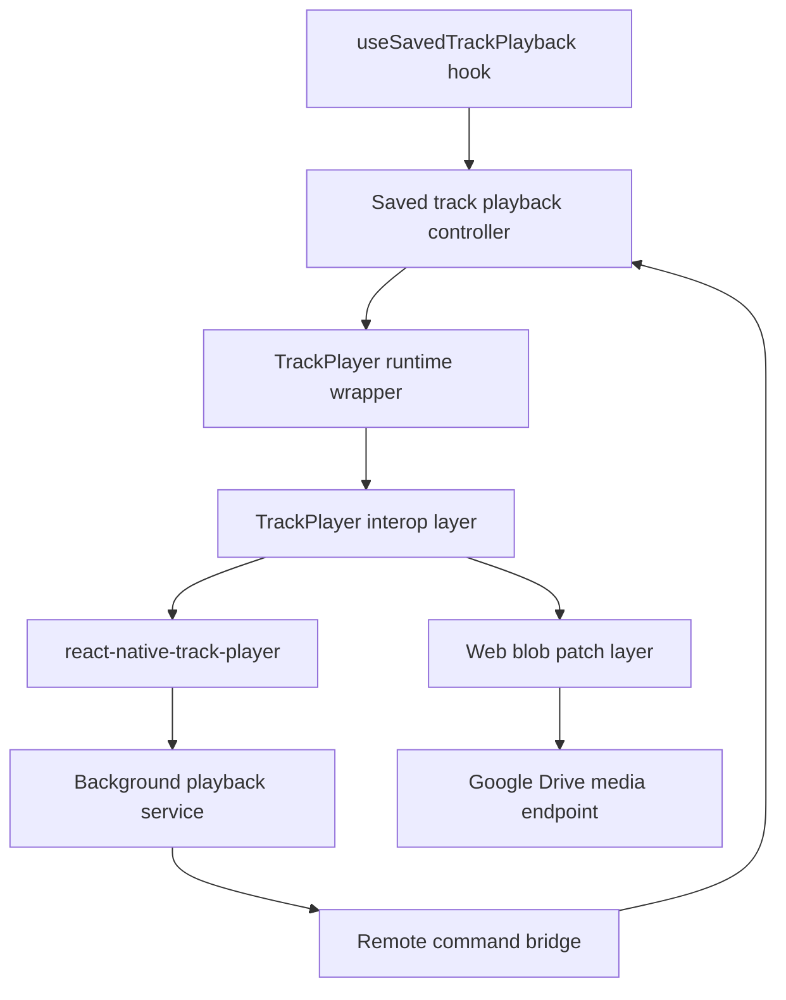

# Mobile Cross-Platform Audio Playback

This document explains how the mobile rehearsal player implements cross-platform playback with `react-native-track-player` and web runtime support that depends on `shaka-player`.

## Summary

- Native iOS and Android playback uses `react-native-track-player` directly.
- Web playback also uses `react-native-track-player` (web runtime), but media loading is patched so authenticated Google Drive requests can be fetched with headers and replayed as blob URLs.
- Background and lock-screen transport controls are bridged through a module-level command handler so native remote events can drive the active React playback controller.

## Why `shaka-player` Is in This App

- `shaka-player` is included as a direct dependency of `@org/mobile-rehearsal-player` to satisfy the web runtime path used by `react-native-track-player`.
- Without this dependency, Expo web/export can fail during module resolution before render.
- The app code does not import `shaka-player` directly; it is required by the TrackPlayer web stack.

## Playback Architecture

```mermaid
flowchart TD
  UI[useSavedTrackPlayback hook]
  Controller[Saved track playback controller]
  Runtime[TrackPlayer runtime wrapper]
  Interop[TrackPlayer interop layer]
  Service[Background playback service]
  Bridge[Remote command bridge]
  Player[react-native-track-player]
  WebPatch[Web blob patch layer]
  Drive[Google Drive media endpoint]

  UI --> Controller
  Controller --> Runtime
  Runtime --> Interop
  Interop --> Player
  Interop --> WebPatch
  WebPatch --> Drive
  Service --> Bridge
  Bridge --> Controller
  Player --> Service
```

## Key Modules

- App entry and service registration:
  - `packages/mobile-rehearsal-player/index.js`
- TrackPlayer interop and environment detection:
  - `packages/mobile-rehearsal-player/src/app/library/playback/utils/saved-track-player-interop.ts`
- Web runtime patching (header fetch -> blob URL -> cleanup):
  - `packages/mobile-rehearsal-player/src/app/library/playback/utils/saved-track-player-web-load.ts`
- Web media download (streamed progress, slow flag, abort on reset) and its progress store:
  - `packages/mobile-rehearsal-player/src/app/library/playback/utils/saved-track-web-download.ts`
  - `packages/mobile-rehearsal-player/src/app/library/playback/utils/saved-track-download-progress.ts`
- Playback shaping engine, pitch capability, and the web pitch graph:
  - `packages/mobile-rehearsal-player/src/app/library/playback/shaping/`
- Player setup and capability sync:
  - `packages/mobile-rehearsal-player/src/app/library/playback/utils/saved-track-player-runtime.ts`
- Playback request construction (Drive URL + auth headers):
  - `packages/mobile-rehearsal-player/src/app/library/playback/utils/saved-track-playback-view-model.ts`
- Runtime load/play/pause/seek commands:
  - `packages/mobile-rehearsal-player/src/app/library/playback/utils/saved-track-playback-controller/runtime-core.ts`
  - `packages/mobile-rehearsal-player/src/app/library/playback/utils/saved-track-playback-controller/runtime-commands.ts`
- Remote command bridge:
  - `packages/mobile-rehearsal-player/src/app/library/playback/utils/saved-track-playback-remote-controls.ts`
  - `packages/mobile-rehearsal-player/src/app/library/playback/utils/saved-track-playback-service.ts`
- Hook that binds playback state/effects and remote handlers:
  - `packages/mobile-rehearsal-player/src/app/library/playback/hooks/use-saved-track-playback/effects.ts`

## Platform Behavior

### Native iOS and Android

- `resolveSavedTrackPlayerSupport` loads TrackPlayer unless runtime detection identifies Expo Go.
- `ensureSavedTrackPlayerReady` calls `setupPlayer` once and applies base transport capabilities.
- `syncSavedTrackPlayerCapabilities` enables queue next/previous controls when a playlist session is active.
- `registerSavedTrackPlayerPlaybackService` wires TrackPlayer remote events to the app service.

### Web

- Interop applies the web patch only when `Platform.OS === 'web'` and browser APIs are present.
- Tracks with auth headers are fetched manually, converted to blob URLs, and passed into TrackPlayer runtime calls.
- Blob URLs are tracked and revoked on `reset` and `stop` to avoid leaks.
- `reset` and `stop` also abort any download still in flight, so a superseded load rejects with an abort error (which the controller ignores) instead of adding a stale track.
- A player-level load patch updates the media element source for blob playback (`window.rntp`).

### Expo Go Guardrail

- Playback is intentionally disabled in Expo Go because native TrackPlayer is unavailable there.
- Interop returns a stable unsupported state and message so UI can degrade gracefully.

## Remote Control Flow

1. App startup registers `savedTrackPlaybackService` via `registerPlaybackService`.
2. The service subscribes to TrackPlayer remote events (`RemotePlay`, `RemotePause`, `RemoteNext`, `RemotePrevious`).
3. Those events dispatch module-level remote commands.
4. `useSavedTrackPlayback` registers handlers that call the active controller methods.

This separation keeps background service code lightweight while allowing current in-memory app state and queue logic to stay inside the React/controller layer.

## Authenticated Drive Playback Flow

1. `createSavedTrackPlaybackRequest` builds a track payload with Drive media URL and `Authorization: Bearer ...` headers.
2. Runtime commands reset TrackPlayer, add the requested track, seek to range start, and optionally play.
3. On web, header-bearing requests are fetched first and rewritten to blob URLs before TrackPlayer consumes them.

## Waveform Peaks

The waveform draws the item's own audio, never a synthetic shape (design Decision 4). Modules:

- `@org/audio-library-models` `waveform-peaks.ts`: the framework-agnostic model. One byte per bucket, one bucket per millisecond up to 120,000 (`getPeakBucketCount`), `computeWaveformPeaks` from PCM, serialization, and `resolveWaveformBars` to slice an item's range into display bars.
- `library/playback/waveform-peaks/`: `peak-registry.ts` (in-memory view per Drive file, shared analyses), `peak-cache.ts` (Drive-version keyed, size-budgeted LRU), `peak-store.web.ts` (IndexedDB) and `peak-store.ts` (AsyncStorage), `peak-extractor.web.ts` (`decodeAudioData`) and `peak-extractor.ts` (native: none yet), `peak-extraction-service.ts`, and `use-waveform-peaks.ts`.
- Flow on web: `saved-track-web-download.ts` announces each finished download (`saved-track-download-events.ts`); the service decodes those bytes once, publishes the peaks to the registry, and persists them. `PlaybackWaveform` calls `useWaveformPeaks(source)` and draws the flat placeholder band until peaks exist, so a file shows real peaks after its first play and on later visits.
- Not yet covered: native extraction, and files that have never been played (tasks 8.41, 8.43).

## Playback Shaping (Speed and Pitch)

Speed and pitch are two independent axes (design Decision 6 of `nocturne-visual-system-and-playback-shaping`). The engine lives in `library/playback/shaping/` and is reached through `getPlaybackShapingEngine()`; callers clamp to the product ranges before calling it.

| Axis                             | Web                                                              | iOS                                                                                       | Android                                      |
| -------------------------------- | ---------------------------------------------------------------- | ----------------------------------------------------------------------------------------- | -------------------------------------------- |
| Speed (always pitch-preserving)  | element `playbackRate`; browsers keep pitch via `preservesPitch` | `setRate`; tracks carry the `Music` pitch algorithm (`pitch-preserving-track-options.ts`) | `setRate` (ExoPlayer speed, pitch stays 1.0) |
| Semitone pitch (tempo unchanged) | SoundTouch AudioWorklet (`@soundtouchjs/audio-worklet`)          | **not implemented**                                                                       | **not implemented**                          |

- `playback-shaping-engine.ts`: `setSpeed(SpeedTransform)` / `setSpeedMultiplier`, `setPitchSemitones`, `getState`, `reset`. `SpeedTransform` is `multiplier | tempoMap`; only `multiplier` is implemented and `tempoMap` rejects with `UnsupportedSpeedTransformError`.
- `canShapePitch` is defined in one place (`playback-shaping-capabilities.ts`, with the reasons). Where it is false, `setPitchSemitones` returns `{ applied: false }`, changes no state, and never approximates pitch through the rate (that would change tempo). The shaping UI shows an inert pitch control with `PITCH_UNAVAILABLE_REASON` instead. Native pitch is deliberately deferred (tasks 8.51); it needs new native modules because iOS plays through `AVPlayer` (via `SwiftAudioEx`) and `react-native-track-player` exposes no pitch on Android.
- Web pitch graph (`web-pitch-shifter-core.ts`, wired in `web-pitch-shifter.web.ts`): media element → `createMediaElementSource` → SoundTouch node → destination, built on the first non-zero pitch. The element keeps tempo (`playbackRate` with `preservesPitch`), and its volume and mute still apply upstream, so the volume slider needs no extra gain node. Pitch changes are applied in call order.
- The processor script ships as a Metro asset, `assets/audio/soundtouch-processor.worklet` (extension registered in `metro.config.js`), because the worklet scope loads it by URL. It is fetched and re-served as a `text/javascript` blob (`addModule` rejects other MIME types). A spec keeps it identical to the installed package's file; re-copy `.dist/soundtouch-processor.js` after upgrading the package.
- Measured on web (2026-10-02, preview at 375 × 812, audio routed to an analyser): +3 st read 525 Hz (target 523.3), −5 st 329.1 Hz (329.6), 0 st 441 Hz (440), and +3 st at 0.7× speed still 525 Hz; graph build 55 ms; SoundTouch costs about 0.1% of a core on a 5-minute track in a Node benchmark.
- `reset()` on the player between items (`loadIntoPlayer` resets and re-adds the track) may drop the native rate; the session wiring (task 5.3) must re-apply the active shaping after each load.

## Slow Connections (Web)

Web playback cannot stream an authenticated Drive file: the media element cannot send the `Authorization` header, so the web patch downloads the **whole file** (`GET …/files/<id>?alt=media`) into a blob before TrackPlayer gets it. Playback therefore starts only when the download finishes, and that takes as long as the connection needs. Measured on 2026-09-30 on a connection the browser reported as `3g` (1.3 Mbps, 350 ms RTT): a 3:08 MP3 took **92.7 s** to download. Native streams directly and has no download step.

What the app shows (task 8.33 of `nocturne-visual-system-and-playback-shaping`):

- The tapped item becomes the active item, and a started playlist or queue becomes the active session, **before** the download begins. The mini-player, the sheet, the loading row's `Loading…` control, and the queue controls (Up Next, previous / next, repeat, shuffle, `Play next` / `Add to queue`) appear at once.
- The mini-player context line and the sheet read `Loading from Google Drive · 42%` (from `Content-Length`; no percentage when the response has none), then after 5 s `Slow connection · 42% downloaded`. The play / pause ring shows a spinner.
- Starting another item, playlist, or queue position during the download supersedes it: the player resets, the old download is aborted, and nothing is reported as an error. Only the loading item's own control stays disabled.
- In development builds, a download that passes 5 s logs one `console.warn` starting `[playback] Slow web media download:` with the Drive file id, elapsed time, and bytes received so far.

How to tell a slow connection from a playback bug in the browser:

- `navigator.connection` gives the browser's estimate (`effectiveType`, `downlink` in Mbps, `rtt` in ms).
- A Resource Timing entry for the `alt=media` request appears only once the response ends; its `duration` is the download time. While it is still running there is no entry at all, which is easy to misread as "no request was made".
- To exercise the loading state on a fast connection, slow every stream read in the page before pressing play, for example by wrapping `ReadableStreamDefaultReader.prototype.read` with a 300 ms delay in the devtools console.
- Browser-pane screenshots can lag the DOM; read the mini-player's `Now playing: …` accessibility label or the page text to see the current state.

## Implementation Notes

- Playlist entry identity uses a TrackPlayer id strategy that includes `playlistEntryId` when present, so duplicate source tracks in a queue remain distinct.
- Duration probing includes a temporary muted play fallback for Drive tracks that delay metadata duration.
- The web patch is idempotent and symbol-guarded to avoid re-patching runtime/player methods.

## Testing and Verification

- Unit tests for interop/runtime patching and service behavior live alongside playback utilities under:
  - `packages/mobile-rehearsal-player/src/app/library/playback/utils/*.spec.ts`
- Typical validation targets:
  - `npm exec -- nx run mobile-rehearsal-player:test`
  - `npm exec -- nx run mobile-rehearsal-player:typecheck`
  - `npm exec -- nx run mobile-rehearsal-player:build` (web export path)

## When To Update This Doc

Update this document whenever any of the following changes:

- playback runtime selection or platform guards
- TrackPlayer initialization/options/capability behavior
- web blob patch mechanics or cleanup behavior
- background remote-event command bridge shape
- dependency strategy for TrackPlayer web runtime, including `shaka-player`
